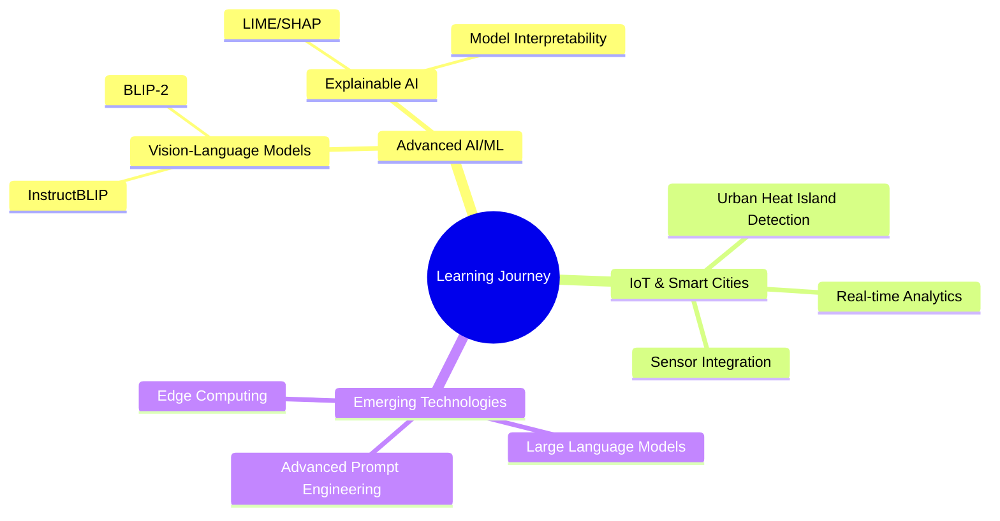

<div align="center">

<!-- Dynamic Banner with animated wave -->


</div>

<div align="center">

<!-- Animated typing effect -->


<!-- Profile badges with modern styling -->
<p>
  
  
  
</p>

</div>

---

## 🚀 About Me


```javascript
const rusith = {
    pronouns: "He/Him",
    code: ["JavaScript", "Python", "Java", "Swift", "C++"],
    askMeAbout: ["Web Dev", "AI/ML", "Mobile Dev", "Cloud Computing"],
    technologies: {
        frontEnd: {
            js: ["React", "Vue", "Angular"],
            css: ["Tailwind", "Bootstrap", "Styled Components"]
        },
        backEnd: {
            js: ["Node.js", "Express"],
            python: ["Django", "Flask", "FastAPI"],
            java: ["Spring Boot"]
        },
        databases: ["MongoDB", "MySQL", "PostgreSQL", "Firebase"],
        cloud: ["AWS", "Azure", "Google Cloud", "Docker"],
        aiMl: ["TensorFlow", "PyTorch", "Scikit-learn", "OpenCV"]
    },
    currentFocus: "Building intelligent applications with AI/ML",
    funFact: "I debug with console.log() and I'm not ashamed! 😄"
};
```

---

## 📊 GitHub Analytics

<div align="center">
  


</div>

<div align="center">
  
[](https://git.io/streak-stats)

</div>

<div align="center">
  


</div>

---

## 🏆 Featured Projects

<div align="center">

<table>
<tr>
<td width="50%">

### 🏥 Health Insurance Cost Prediction
*AI-powered cost prediction with interactive dashboard*

**Tech Stack:** `Streamlit` `XGBoost` `scikit-learn` `pandas`

[](https://github.com/Rusith21/Health-Insurance-Cost-Prediction)

</td>
<td width="50%">

### 🔢 Number & Shape Identifier
*Deep learning model for real-time recognition*

**Tech Stack:** `Flask` `TensorFlow` `Keras` `HTML/CSS`

[](https://github.com/Rusith21/number-identify-app)

</td>
</tr>
<tr>
<td width="50%">

### 🎬 FlixFinder
*Movie discovery app with personalized recommendations*

**Tech Stack:** `SwiftUI` `TMDB API` `Core Data`

[](https://github.com/Rusith21/FlixFinder)

</td>
<td width="50%">

### ⚕️ MediSync DoctorService
*Microservice architecture for healthcare management*

**Tech Stack:** `Node.js` `Express` `MongoDB` `Docker`

[](https://github.com/Rusith21/DoctorService)

</td>
</tr>
</table>

</div>

---

## 🛠️ Tech Stack

<div align="center">

### Languages


### Frontend


### Backend


### Database & Cloud


### AI/ML


</div>

---

## 🌱 Currently Exploring

<div align="center">



</div>

---

## 🏆 Achievements & Certifications

<div align="center">


</div>

---

## 📈 Contribution Graph

<div align="center">


</div>

---

## 🤝 Let's Connect

<div align="center">

[](https://linkedin.com/in/your-profile)
[](https://twitter.com/yourhandle)
[](mailto:rusithwijesinghe7@gmail.com)
[](#)

</div>

---

<div align="center">

### 💭 Random Dev Quote


### 🎵 Spotify Playing
[](https://open.spotify.com/user/YOUR_SPOTIFY_USERNAME)

</div>

---

<div align="center">

<!-- Animated footer -->


**"Code is poetry written in logic"** ✨

*Made with ❤️ and lots of ☕*

</div>
